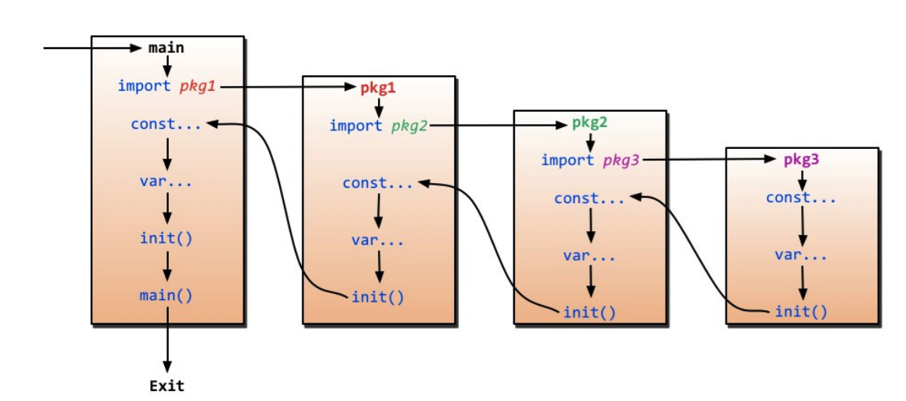

# vendor
before go 1.5, if you want to use a specific version of a package or modify a package, there are two ways to do that: 
* copy the package source codes into another folder, then modify its import path.
it changes the source codes.

* copy the package source codes into another folder, then add it to the gopath
it add a gopath which is only for the specific package, it is useless.

* use the a version control software only to get that version of source codes
right now a package is always dependent on other packages, so it is necessary to get all that version of souces codes.

after go 1.5, there is a feature vendor, packages must still reside in GOPATH. However, if a package or a parent folder of a package contains folder named vendor it will be searched for dependencies using the vendor folder as an import path root. While vendor folders can be nested, in most cases it is not advised or needed. Any package in the vendor folder will be found before the standard library.

# Header
prepare all things in header, then call WriteHeader, then call Write.  
you must obey the rule, if not, for example, WriteHeader first, then prepare things in header, call Write last. the things in header will not be writen in response header.
```
w.WriteHeader(http.StatusCreated)  
w.Header().Set("Content-Type", "application/json")  
w.Write(js)
```
the Content-Type is not application/json, it is a default value plain/text.
```
w.WriteHeader(http.StatusCreated)
w.Header().Set("Content-Type", "application/json")
w.Write(js)
```
the response code is 200, not http.StatusCreated, and also the Content-Type value is ignored either, as the function Write checks if Header was written, if not, it calls WriteHeader to set 200 and default values, if it is, do nonthing.
when calling WriteHeader, it will set status code and copy the handler header to the response header which is returned to clients.

# map
map is not safe in multi-runtine, it can be read in multi go runtines, but if you has a write go runtine and at least one read or write, it will be panic.

# go get
go get acctually is to clone the source codes to the first directory in GOPATH by default and execute go install, it also clones all dependent package to the local, it clones the source codes by using different version control tools, for example when accessing github, use git, when accessing google code, use git Mercurial, or Subversion

# variable defination
short defination can only be used in function body, so it means that global variable defination must be used in long variable defination.

const variable can have type or not, it is defined in the compile time

string can be defined in "" or '', "" means a string which can include transfer charactor, '' means a string which is kept as original.  
it is const, so it can not be changed during runtime. so the following codes have compile errors
```
var s string = "hello"   
s[0] = 'c'
```
so if you really want to change the string, you need to change it to []byte, then change, but it is a different variable.

# iota
iota is init to 0, when meeting const, it is reseted to 0

# make and new
make is only used to make chan, map and slice, which are a build-in struct.  
new can be used for other build-in type and other defined struct.

# range
range can be used to iterate all elements in slice and map

# init
each package can have init function, it can be more than one. the init sequence begins in main package, the sequence as the import order, before the init function of a package, all the imported packages' init function must be executed first


# import
if it is system package, such as fmt, package name is ok, it will be loaded in goroot.

* relative path,   
import “./model” it imports the model package in the same fold as the importing file.
* absolute path
import “shorturl/model”, it imports gopath/src/shorturl/model

# package
* .
import(
 . "fmt"
)
it means you can use function with no package name
* alias
import(
 f "fmt"
)
use a meaning package name to call the function in the package fmt
* _
import (
 "database/sql"
 _ "github.com/ziutek/mymysql/godrv"
)
you just want to use the package init function, no need to access the functions in the package

# chan
no buffer chan is a good to sync with other go runtine. it means c<-1, the runtine is blocked, and continued when there is another runtine which receives data from c.  
buffer chan can be queued, when buffer size is 2, it means it can receive 2 datas, the runtinue can also run, but when there is another data to receive, the runtine is blocked.
```
 for i := range c {
 	fmt.Println(i)
 }
```
use range to consume data in channel, when channel is close, for loop exits.  
it is better to close a channel in a producer thread, because it will cause panic when closing a channel in a consumer thread.
the following are example:  
* use a channel as the sync flag
```
func sum(a []int, c chan int) {
 sum := 0
 for _, v := range a {
 sum += v
 }
 c <- sum // send sum to c
}
func main() {
 a := []int{7, 2, 8, -9, 4, 0}
 c := make(chan int)
 go sum(a[:len(a)/2], c)
 go sum(a[len(a)/2:], c)
 x, y := <-c, <-c // receive from c
 fmt.Println(x, y, x + y)
}
```
* use a channel as the exit flag
```
func fibonacci(c, quit chan int) {
 x, y := 1, 1
 for {
 select {
 case c <- x:
 x, y = y, x + y
 case <-quit:
 fmt.Println("quit")
 return
 }
 }
}
```
* timeout
```
func main() {
 c := make(chan int)
 o := make(chan bool)
 go func() {
 for {
 select {
 case v := <- c:
 println(v)
 case <- time.After(5 * time.Second):
 println("timeout")
 o <- true
 break
 }
 }
 }()
 <- o
}
```

# http
* cookie:  
as http is stateless, use cookie to maintain the state in a request, it is set by the website.  
it is used to remember stateful information such as items added in the shopping cart in an online store or to record the user's browsing activity including clicking particular buttons, logging in, or recording which pages were visited in the past and so on.  
Perhaps most importantly, authentication cookies are the most common method used by web servers to know whether the user is logged in or not and which account they are logged in with.
	1.  Session cookie  
	also known as an in-memory cookie or transient cookie, exists only in temporary memory while the user navigates the website, web browser deletes them when the use closes the web browser. no expiration.
	2. Persistent cookie  
	it expires at a specific date or after a specific length of time, it will be transmitted to the server every time the user visits the website that it belongs to. for this reason, it is sometimes referred to as tracking cookies because they can be used by ad to record information about a user's web browsing habits over an extended period of time.  
	it is used for "legitimate" reasons such as keeping users logged into their accounts, to avoid re-entering login credential at every visit.
	3. Secure cookie: the flag "Secure"  
	it can only be transmitted over an encrypted connection such as https, that makes the cookies less likely to be exposed to cookies theft.
	4. HttpOnly cookie: the flag "HttpOnly"
	it can not be accessed by client-side APIs such as JavaScript
	5. SameSite cookie: the flag "SameSite" to Strict or Lax  
	Google Chrome 51 recently introduced, a new kind of cookie which can only be sent in requests originating from the same origin as the target domain.
	6. Third-party cookie
	Normally a cookies' domain attribute will match the domain shown in the web browser's address bar, this is called a first-party cookie, the third party cookie, however, belongs to a domain different from the shown in the address bar. for example, a user visits www.example.org, which contains an advertisement from ad.foxytracking.com, which when downloaded, sets a cookie belonging to the advertisement's domain, then the user visits another website www.foo.com, which also contains an advertisement from ad.foxytracking.com, and which also sets a cookie belonging to that domain. eventually, both of these cookies will be sent to the advertiser when loading their advertisements or visiting their website, then the advertiser can then use these cookies to build up a browsing history of the user across all the websites that have ads from this advertiser.  
	most modern web browsers contain privacy settings that can block third-party cookies.
	7. Super Cookies
	a cookie with an origin of a top-level domain such as .com or a public suffix such as .co.uk, it may affect a request made to example.com or even if the cookie didn't originate from example.com, right now it is blocked by web browsers. sometimes it is used for tracking technologies that do not reply on HTTP cookies.
	8. Zombie cookie
	it is automatically recreated after being deleted
* cookie attribute
weather a cookie can be carried in the request is dependent on domain and path:   a. if the request's domain matches the cookie's domain or it is the child of the cookie's domain  
b. if the request's path matches the cookie's path or it is the child of the cookie's path.
both conditions are true, then the cookie can be carried otherwise can't   
	1. the domain and path attributes define the scope of the cookie, they essentially tell the browser what website the cookie belongs to. for obvious securtiy reasons, cookies can only be set on the current resource's top domain and its sub domains, and not for another domain and its sub domains. for example, the website example.com can't set a cookie that has a domain of foo.com because this would allow the example.com website to control the cookies of foo.com.  
if a cookie's domain and path attributes are not specified by the server, they default to the domain and path of the resource that was requested. However, in most browsers there is a fifference between a cookie set from foo.com without a domain, and a cookie set with the foo.com domain, in the former case, the cookie will only be sent for requests to foo.com, in the latter case, all sub domains are also included(for example, docs.foo.com). a notable exception to this general rule is IE, which always sends cookies to sub domains regardless of whether the cookie was set with or without a domain.  
> HTTP/1.0 200 OK
> Set-Cookie: LSID=DQAAAK…Eaem_vYg; Path=/accounts; Expires=Wed, 13 Jan 2021 22:23:01 GMT; Secure; HttpOnly
> Set-Cookie: HSID=AYQEVn…DKrdst; Domain=.foo.com; Path=/; Expires=Wed, 13 Jan 2021 22:23:01 GMT; HttpOnly
> Set-Cookie: SSID=Ap4P…GTEq; Domain=foo.com; Path=/; Expires=Wed, 13 Jan 2021 22:23:01 GMT; Secure; HttpOnly
> …

The first cookie, LSID, has no Domain attribute, and has a Path attribute set to /accounts. This tells the browser to use the cookie only when requesting pages contained in docs.foo.com/accounts (the domain is derived from the request domain). The other two cookies, HSID and SSID, would be used when the browser requests any subdomain in .foo.com on any path (for example www.foo.com/bar). The prepending dot is optional in recent standards, but can be added for compatibility with RFC 2109 based implementations.[35]

Expires and Max-Age
The Expires attribute defines a specific date and time for when the browser should delete the cookie. The date and time are specified in the form Wdy, DD Mon YYYY HH:MM:SS GMT, or in the form Wdy, DD Mon YY HH:MM:SS GMT for values of YY where YY is greater than or equal to 0 and less than or equal to 69.[36]

Alternatively, the Max-Age attribute can be used to set the cookie's expiration as an interval of seconds in the future, relative to the time the browser received the cookie. Below is an example of three Set-Cookie headers that were received from a website after a user logged in:

HTTP/1.0 200 OK
Set-Cookie: lu=Rg3vHJZnehYLjVg7qi3bZjzg; Expires=Tue, 15 Jan 2013 21:47:38 GMT; Path=/; Domain=.example.com; HttpOnly
Set-Cookie: made_write_conn=1295214458; Path=/; Domain=.example.com
Set-Cookie: reg_fb_gate=deleted; Expires=Thu, 01 Jan 1970 00:00:01 GMT; Path=/; Domain=.example.com; HttpOnly
The first cookie, lu, is set to expire sometime on 15 January 2013. It will be used by the client browser until that time. The second cookie, made_write_conn, does not have an expiration date, making it a session cookie. It will be deleted after the user closes their browser. The third cookie, reg_fb_gate, has its value changed to "deleted", with an expiration time in the past. The browser will delete this cookie right away because its expiration time is in the past. Note that cookie will only be deleted if the domain and path attributes in the Set-Cookie field match the values used when the cookie was created.

As of 2016 Internet Explorer did not support Max-Age.[37][38]

Secure and HttpOnly
The Secure and HttpOnly attributes do not have associated values. Rather, the presence of just their attribute names indicates that their behaviors should be enabled.

The Secure attribute is meant to keep cookie communication limited to encrypted transmission, directing browsers to use cookies only via secure/encrypted connections. However, if a web server sets a cookie with a secure attribute from a non-secure connection, the cookie can still be intercepted when it is sent to the user by man-in-the-middle attacks. Therefore, for maximum security, cookies with the Secure attribute should only be set over a secure connection.

The HttpOnly attribute directs browsers not to expose cookies through channels other than HTTP (and HTTPS) requests. This means that the cookie cannot be accessed via client-side scripting languages (notably JavaScript), and therefore cannot be stolen easily via cross-site scripting (a pervasive attack technique).[39]

* get and post
as get puts all parameters in the url, there is a limitation for an url length, while post doesn't have that as it puts all parameters in the body.  
and it is not safe to use get to send requests as we can see the requests.
* keep-alive
http enables keep-alive by default, it means that it doesn't close a http request after it gets its response, it will use that when sending another request to the same server.
# how to extend existing type in another package
You can define your own alias or sub-package as follows:
```
type MyRouter mux.Router

func (m *MyRouter) F() { ... }
```
or by embedding the original router
```
type MyRouter struct {
    *mux.Router
}

func (m *MyRouter) F() { ... }

...
r := &MyRouter{router}
r.F()
```

# const
there are two const variables, one is typed, the other is untyped.
```
const untyped = "hello world" untyped
const typed string = "hello world" typed
```
the first line is untyped, and the second is typed.
typed const variable can only be assigned to the const variables while untyped const variable can be assigned to any variables which accept the variable.
```
type MyString string
var myStr MyString = typed // error
var myStr MyString = untyped //ok, it is equal to var myStr MyString = "hello world"
```
for all const variables, they all have their default type, if there is no implicit type, it goes to its default type.
for example:
* string is string by default
* 0 is int
* 0.0 is float
and so on

# for i and range
```
for i := 0; i < len(str); i++{
//iterator the str by byte
}
for i,v : range str{
//iterator the str by char, for unicode, one char has two bytes
}
```

# json.RawMessage
when marshal json.RawMessage, it can't be empty, it has to be a json, if it is empty, it has to be "{}"
```
	bytes, err := json.Marshal(&struct {
		Hello string
		Body  json.RawMessage
	}{
		Hello: "hello world",
		Body:  nil/make([]byte,0),
	})
```
when body is nil or empty,the function Marshal will return err which is "json: error calling MarshalJSON for type json.RawMessage: unexpected end of JSON input"
```
	bytes, err := json.Marshal(&struct {
		Hello string
		Body  json.RawMessage
	}{
		Hello: "hello world",
		Body:  json.RawMessage{'{','}'},
	})
```
the output is
```
bytes: {
	"Hello": "hello world",
	"Body": {}
}
```
if you want to marshal your properties, you must set your property public

# whether using pointers or not in request struct besiding the memory issue
it depends on if the value 0 is a legal value for the field variable, if it is, use a pointer, if it isn't, using value type variable is ok.
for required fields, use value variables.
if omitempty is in the field tag, it means that when marshaling, if it is a value, its value is 0, then the field is not marshalled.
if it is a pointer, its value is nil, the field is not marshalled, but it has a value which is 0, it can be marshalled.
if there is no omitempty, for a value type, if it is 0, it is marshalled into 0. for a pointer type, if it is nil, it is marshalled into null.


